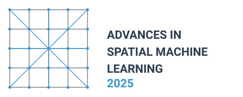
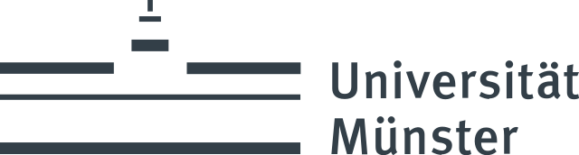
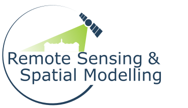

 

## Workshop Overview

This two-day scientific workshop aims to bring together leading researchers in the field of spatial machine learning. 
Unlike many conferences that focus on showcasing achievements, our goal is to address unsolved issues and open questions, fostering innovation and collaboration.

## Key Topics

1. **Validation and Preservation of Spatial Patterns**: Ensuring models provide accurate local predictions while preserving important spatial patterns.
2. **Comparable Approaches Across Algorithm Types**: Investigating how different algorithms (e.g., traditional vs. deep learning) can be compared and integrated for improved spatial predictions.
3. **Analysis and Communication of Prediction Uncertainties**: Discussing methods for analyzing and communicating uncertainties in spatial predictions for informed decision-making.
4. **Standardized Documentation Protocols**: Developing standardized documentation for spatial machine learning models to enhance reproducibility and knowledge transfer.
5. **Comparability between Wrapper Packages**: Exploring differences and similarities between popular software packages like caret/CAST, tidymodels, mlr3, and sits to promote interoperability.
6. **Cutting-Edge Developments**: A session dedicated to discussing the latest developments and emerging trends in spatial machine learning.

## Location and Date

The workshop will take place 24-25 March 2025 (just before the [FOSSGIS 2025](https://fossgis-konferenz.de/2025/) conference) in room 554 at the [Institute of Landscape Ecology](https://www.uni-muenster.de/Landschaftsoekologie/en/index.html) at the University of Münster, Germany.

The address is:

> Heisenbergstr. 2 
> D-48149 Münster 
> Deutschland 

([OpenStreetMap](https://www.openstreetmap.org/node/2122669361#map=19/51.969496/7.595801), [Google Maps](https://maps.app.goo.gl/xnPyqwSmXPi2EDvd8))

## Program

| Day/time        | Topic                                                                                           |
| --------------- | ----------------------------------------------------------------------------------------------- |
| __Sun, Mar 23__ |                                                                                                 |
|                 |                                                                                                 |
| 18:30           | *Ice breaker*, Cavete ([OpenStreetMap](https://www.openstreetmap.org/way/251734927), [Google Maps](https://maps.app.goo.gl/v8bHCEzbv9rkvE12A))                                                            |
|                 |                                                                                                 |
|                 |                                                                     |
| __Mon, Mar 24__ |                                                                                                 |
| 9:00-9:45      | **Welcome, event overview & introductions** |
| 9:45-10:30     | *Coffee break*                                                                                      |
| 10:30-12:15     | **Analysis and Communication of Prediction Uncertainties**. Chair(s): Alexander Brenning, Darius Görgen, Madlene Nussbaum        |
| 12:15-13:30     | *Lunch break*                                                                                     |
| 13:30-15:00     | **Comparable Approaches Across Algorithm Types**. Chair(s): Carles Mila, Luca Patelli, Marta Jemeļjanova
| 15:00-15:30     | *Coffee break*                                                                                       |
| 15:30-17:00     | **Comparability between Wrapper Packages**. Chair(s): Mike Mahoney, Rolf Simoes                      |                                          |
|                 |                                                                                                 |
| 19:00           | *Dinner*, Le Feu ([OpenStreetMap](https://www.openstreetmap.org/node/667887075), [Google Maps](https://maps.app.goo.gl/XqqU7QU92i7N2P7FA))                                                          |
|                 |                                                                                                 |
| __Tue, Mar 25__ |                                                                                                 |
| 9:00-10:30      | **Validation and Preservation of Spatial Patterns**. Chair(s): Evelyn Uuemaa, Teja Kattenborn                                                        |
| 10:30-11:00     | *Coffee break*                                                                                      |
| 11:00-12:30     | **Standardized Documentation Protocols**. Chair(s): Jan Linnenbrink                                                    |
| 12:30-13:30     | *Lunch break*                                                                                     |
| 13:30-15:00     | **Cutting-Edge Developments**            |
| 15:00-15:30     | *Coffee break*                                                                                     |
| 15:30-16:30     | **Closing, future plans**                          |

## Participants

We invited researchers actively working on spatial machine and deep learning:
<!-- This intimate setting will allow for in-depth discussions and meaningful collaborations. -->

- Teja Kattenborn
<!-- - Teja Kattenborn plus one -->
- Evelyn Uuemaa
- Marta Jemeljanova
- Madlene Nussbaum
- Carmelo Bonannella
- Rolf Simoes
- Mike Mahoney
- Patrick Schratz
- Luca Patelli
- Carles Milà
- Alexander Brenning
- Marvin Ludwig
- Jan Linnenbrink
- Darius Görgen
- Hanna Meyer
- Jakub Nowosad

## Expected Outcomes

By bringing together experts in the field, we anticipate:

- Identifying key challenges and research priorities in spatial machine learning
- Fostering collaborations between different research groups
- Developing guidelines for best practices in spatial machine learning documentation and validation
- Generating ideas for future research projects and potential funding opportunities

This workshop represents a unique opportunity to shape the future of spatial machine learning in ecological research by focusing on open questions and challenges.

## Organizers

- [Hanna Meyer, University of Münster](https://www.uni-muenster.de/RemoteSensing/team/meyer/index.html)
- [Jakub Nowosad, Adam Mickiewicz University; University of Münster](https://jakubnowosad.com/)

## Supported by

