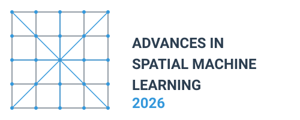

 

## Workshop Overview

This two-day scientific workshop aims to bring together leading researchers in the field of spatial machine learning. 
Unlike many conferences that focus on showcasing achievements, our goal is to address unsolved issues and open questions, fostering innovation and collaboration.

## Key Topics

1. **Validation and Preservation of Spatial Patterns**: Ensuring models provide accurate local predictions while preserving important spatial patterns.
2. **(Spatial) xAI**
3. **How to ensure that the spatial ML model is useful?**: how to avoid overfitting, do we need better algorithms or better training and validation data?
4. **Common mistakes in spatial ML**
5. **New methods/emerging trends** (e.g., foundational models, conformal predictions, etc.)
6. **An "open" session** - we welcome participants to propose relevant topics.

## Location and Date

The workshop will take place 9-10 April 2026 at the University of Tartu Library, W. Struve tn 1, 50091 Tartu, Estonia.

<!-- The address is: -->

<!-- > Heisenbergstr. 2  -->
<!-- > D-48149 Münster  -->
<!-- > Deutschland  -->

<!-- ([OpenStreetMap](https://www.openstreetmap.org/node/2122669361#map=19/51.969496/7.595801), [Google Maps](https://maps.app.goo.gl/xnPyqwSmXPi2EDvd8)) -->

## Program

| Day/time        | Topic                                                      |
| --------------- | ---------------------------------------------------------- |
| __Wed, Apr 8__ |                                                             |
| 19:30--...     | Ice breaker at [RP9](https://maps.app.goo.gl/eKbagLrSSt5rba25A)   |
| __Thu, Apr 9__ |                                                             |
| 9:00--10:30    | Introductions                                               |
| 10:30--11:00   | Coffee break/ Posters                                       |
| 11:00--12:30   |  Session: Common mistakes/challenges in spatial ML. Chair: Alexander Brenning          |
| 12:30--13:30   | Lunch/ Posters                                              |
| 13:30--15:00   | Session: How to ensure that the spatial ML model is useful? Chair: Laura Poggio  |
| 15:00--15:30   | Coffee break/ Posters                                       |
| 15:30--17:00   | Session: Spatial validation. Chairs: Hanna Meyer, Jakub Nowosad, Mahdi Khodadadzadeh                                |
| 18:00--19:30   | City Excursion                                              |
| 19:30--...     | Joint dinner at [Kolm Tilli](https://maps.app.goo.gl/PHMDmYJb6BmThmeP9)    |
| __Fri, Apr 10__ |                                                            |
| 9:00-10:30      | Session: xAI in spatial ML. Chair: Lily-Belle Sweet                                 |
| 10:30-11:00     |  Coffee break /Posters                                     |
| 11:00-12:30     | Emerging trends: Foundation models in spatial ML. Chair: Jonas Schmidinger       |
| 12:30-13:30     | Lunch /Posters                                             |
| 13:30-15:00     | Emerging trends: DGGS in spatial ML. Chair: Alexander Kmoch        |
| 15:00-15:30     |  Coffee break /Posters                                     |
| 15:30-17:00     | Wrap-up and future plans                                   |

### Open session: posters

If you would like to present a poster related to your work in spatial machine learning, we will have a poster session area available during all coffee breaks and lunch sessions. We especially encourage PhD students to bring and present their posters.

## Participants

We invited researchers actively working on spatial machine learning and deep learning:

- Alexander Brenning
- Laura Poggio
- Felix Henkel
- Jonas Schmidinger
- Jonathan Frank
- Lily-belle Sweet
- Mahdi Khodadadzadeh 
- Alexander Kmoch
- Iris Luik
- Liina Hints
- Jeonghwan Choi
- Evelyn Uuemaa
- Marta Jemeljanova
- Hanna Meyer
- Jakub Nowosad

<!-- ## Program -->

<!--
| Day/time        | Topic                                                                                           |
| --------------- | ----------------------------------------------------------------------------------------------- |
| __Sun, Mar 23__ |                                                                                                 |
|                 |                                                                                                 |
| 18:30           | *Ice breaker*, Cavete ([OpenStreetMap](https://www.openstreetmap.org/way/251734927), [Google Maps](https://maps.app.goo.gl/v8bHCEzbv9rkvE12A))                                                            |
|                 |                                                                                                 |
|                 |                                                                     |
| __Mon, Mar 24__ |                                                                                                 |
| 9:00-9:45      | **Welcome, event overview & introductions** |
| 9:45-10:30     | *Coffee break*                                                                                      |
| 10:30-12:15     | **Analysis and Communication of Prediction Uncertainties**. Chair(s): Alexander Brenning, Darius Görgen, Madlene Nussbaum        |
| 12:15-13:30     | *Lunch break*                                                                                     |
| 13:30-15:00     | **Comparable Approaches Across Algorithm Types**. Chair(s): Carles Mila, Luca Patelli, Marta Jemeļjanova
| 15:00-15:30     | *Coffee break*                                                                                       |
| 15:30-17:00     | **Comparability between Wrapper Packages**. Chair(s): Mike Mahoney, Rolf Simoes                      |                                          |
|                 |                                                                                                 |
| 19:00           | *Dinner*, Le Feu ([OpenStreetMap](https://www.openstreetmap.org/node/667887075), [Google Maps](https://maps.app.goo.gl/XqqU7QU92i7N2P7FA))                                                          |
|                 |                                                                                                 |
| __Tue, Mar 25__ |                                                                                                 |
| 9:00-10:30      | **Validation and Preservation of Spatial Patterns**. Chair(s): Evelyn Uuemaa, Teja Kattenborn                                                        |
| 10:30-11:00     | *Coffee break*                                                                                      |
| 11:00-12:30     | **Standardized Documentation Protocols**. Chair(s): Jan Linnenbrink                                                    |
| 12:30-13:30     | *Lunch break*                                                                                     |
| 13:30-15:00     | **Cutting-Edge Developments**            |
| 15:00-15:30     | *Coffee break*                                                                                     |
| 15:30-16:30     | **Closing, future plans**                          |
-->

<!-- ## Participants -->

<!--
We invited researchers actively working on spatial machine and deep learning:

- Teja Kattenborn
- Evelyn Uuemaa
- Marta Jemeljanova
- Madlene Nussbaum
- Carmelo Bonannella
- Rolf Simoes
- Mike Mahoney
- Patrick Schratz
- Luca Patelli
- Carles Milà
- Alexander Brenning
- Marvin Ludwig
- Jan Linnenbrink
- Darius Görgen
- Hanna Meyer
- Jakub Nowosad
-->

## Expected Outcomes

By bringing together experts in the field, we anticipate:

- Identifying key challenges and research priorities in spatial machine learning
- Fostering collaborations between different research groups
- Developing guidelines for best practices in spatial machine learning documentation and validation
- Generating ideas for future research projects and potential funding opportunities

This workshop represents a unique opportunity to shape the future of spatial machine learning in ecological research by focusing on open questions and challenges.

## Organizers

- [Evelyn Uuemaa, Landscape Geoinformatics Lab, University of Tartu](https://landscape-geoinformatics.ut.ee/)
- [Marta Jemeljanova, Landscape Geoinformatics Lab, University of Tartu](https://landscape-geoinformatics.ut.ee/)
- [Hanna Meyer, University of Münster](https://www.uni-muenster.de/RemoteSensing/team/meyer/index.html)
- [Jakub Nowosad, Adam Mickiewicz University; University of Münster](https://jakubnowosad.com/)

## Supported by

