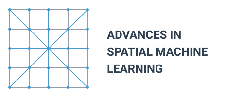

**Advances in Spatial Machine Learning** is a focused workshop for a deliberately limited group of invited researchers working on spatial machine learning, particularly in environmental and geographical applications.

{fig-alt="Advances in Spatial Machine Learning workshop logo" width=300}

The workshop is designed for open discussion rather than conventional conference presentations.
Participants bring unresolved questions, work in progress, and research challenges for which exchange with others can be useful.

## 2027 edition

The next edition is currently being prepared. Further information about the dates, location, program, participants, and organizers will be added when available.

## Format

The workshop lasts two days and brings together roughly fifteen participants.
It includes six focused working sessions, an introduction, and a concluding discussion. 
Sessions combine brief scene-setting contributions with extended time for discussion and brainstorming.

The atmosphere is intentionally informal and low-key. 
Participants are expected to take part actively, share ideas openly, and contribute to discussions beyond their own session.

## Aims

The workshop provides space to:

- identify challenges and priorities in spatial machine learning
- compare perspectives across research groups and applications
- discuss good practice in documentation, validation, and reproducibility
- develop ideas for collaborations, future research, and funding

## Past editions

- [2026 workshop](2026.qmd)
- [2025 workshop](2025.qmd)
